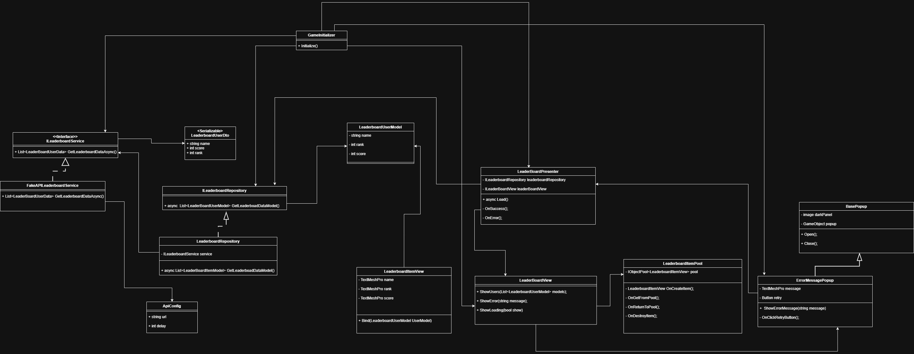

# LeaderboardModule-Task

## معماری (Architecture)
معماری انتخاب‌شده: **MVP (Model-View-Presenter)**

### دلیل انتخاب MVP
- **برتری نسبت به MVC**: برخلاف MVC، در اینجا لایه‌های Model و View کاملاً از هم ایزوله هستند و تمام تعاملات از فیلتر Presenter می‌گذرد که امنیت و نظم کد را تضمین می‌کند.
- **برتری نسبت به MVVM**: در این معماری نیازی به پیچیدگی‌های Data Binding یا کتابخانه‌های Reactive نیست. جریان داده‌ها کاملاً صریح (Explicit) و دیباگ کردن آن‌ها بسیار ساده‌تر است.
- **تست‌پذیری مستقل**: امکان نوشتن تست‌های واحد (Unit Test) برای Presenter بدون نیاز به فریم‌ورک‌های سنگین UI یا شبیه‌ساز.
  
### مزایا
- **تفکیک مسئولیت‌ها (Separation of Concerns)**:
    - **ویو**: فقط مسئول رندر کردن رابط کاربری و ارسال رویدادهای کاربر است.
    - **پرزنتر**: به عنوان واسط، منطق نمایش را مدیریت کرده و داده‌ها را بین لایه‌ها جابه‌جا می‌کند.
- **قابلیت نگهداری بالا**: به دلیل استقلال لایه‌ها، تغییر در ظاهر برنامه (View) هیچ تأثیری بر منطق تجاری (Model) نخواهد داشت.
- **شفافیت در جریان داده**: به دلیل استفاده از Interfaceها، تمام رفتارها و تعاملات سیستم به وضوح در کد تعریف شده و قابل ردیابی است.

### ملاحظات و چالش‌ها (Trade-offs)

##### کاهش Boilerplate
با استفاده از Dependency Injection (تزریق دیپندنسی ها در gameInitializer) و طراحی بهینه سرویس‌ها، میزان کدهای تکراری در مقایسه با MVP سنتی کاهش یافته است.

---

##### مدیریت چرخه حیات
استفاده از `GameInitializer` مدیریت اشیاء و وابستگی‌ها را ساده‌تر کرده و نیاز به مدیریت دستی پیچیده برای جلوگیری از Memory Leak را کاهش داده است.

---

##### اتصال یک‌به‌یک (1:1 Mapping)
هر Presenter به یک View مشخص متصل است؛ رویکردی که تعداد کلاس‌ها را افزایش می‌دهد اما تست‌پذیری و تفکیک مسئولیت‌ها را بهبود می‌بخشد.


---
## ساختار کد (Code Structure)

```text
Assets/Dev/Scripts
│
├── Bootstrap
│   └── GameInitializer        # نقطه ورود برنامه و مقداردهی اولیه
│
├── Data
│   ├── Configs                # تنظیمات مربوط به API و آدرس‌ها
│   ├── DTO                    # اشیاء انتقال داده برای ارتباط با سرویس‌ها
│   └── Repository             # مدیریت منبع داده (انتزاع بین Local و Remote)
│
├── Domain
│   └── LeaderboardUserModel   # مدل‌های خالص کسب‌وکار (Pure Models)
│
├── Presentation
│   ├── Presenter              # منطق نمایش و هماهنگ‌کننده لایه‌ها
│   └── Views                  # مدیریت عناصر بصری و ورودی‌های کاربر
│
└── Services                   # پیاده‌سازی سرویس‌های جانبی و APIهای فرعی
```
    
## UML



## نحوه اجرا (How to Run)

برای اجرای صحیح ماژول Leaderboard در محیط Unity، مراحل زیر را دنبال کنید:

1. **صحنه (Scene) اصلی پروژه** (`GamePlay.unity`) را باز کنید.  این صحنه در پوشه  Asset/Design/Scenes قرار دارد. برای دید بهتر aspect ratio را 9:16 تنظیم کنید و یا روی بیلد اندروید بروید.
2. اطمینان حاصل کنید که اسکریپت **GameInitializer** به یک `GameObject` در صحنه متصل است.
3. در **Inspector**، فیلدهای مربوط به:
   - `Leaderboard View` (ارجاع به View اصلی Leaderboard)
   - `Configs` (ScriptableObject حاوی تنظیمات API)
   را مقداردهی کنید.
4. با زدن دکمه **Play**، سیستم به‌صورت خودکار داده‌ها را از `FakeApiLeaderboardService` فراخوانی کرده و رده‌بندی را نمایش می‌دهد.
5. در صورت اینکه مکررا پاپ اپ ارور دریافت کردید حتما از نت بین الملل و شاید به همراه فیلترشکن استفاده کنید :)

---

## تصمیمات فنی مهم (Technical Decisions)

1 - **استفاده از ScriptableObjects برای تنظیمات**  
   برای مدیریت `ApiConfig` از `ScriptableObject` استفاده شد تا تغییر پارامترهایی مانند `BaseURL`، `Timeout` و `ReturnResponseDelay` بدون نیاز به تغییر کد و در حین اجرا (برای پلتفرم‌های مختلف) امکان‌پذیر باشد.همچنین برای اینکه هیچ پارامتری هاردکد نشود

2 - **استفاده از Object Pooling**  
   برای نمایش آیتم‌های لیست رده‌بندی (Leaderboard Items)، از سیستم Pooling استفاده شده تا کارایی (Performance) برنامه در تعداد ردیف‌های بالا (مثلاً بیش از ۱۰۰ ردیف) حفظ شود و از تخصیص و آزادسازی مکرر حافظه (Garbage Collection) جلوگیری گردد.

3 - **ارتباط مبتنی بر Interface**  
تمامی سرویس‌ها و مخازن دارای اینترفیس هستند تا قابلیت تست‌پذیری (Mocking) و توسعه‌پذیری پروژه تضمین شود.

4 - **جدا کردن Initializer از باقی کدها**  
   `GameInitializer` مسئولیت **ترکیب (Composition)** وابستگی‌ها را بر عهده دارد (شبه تزریق وابستگی دستی) تا MonoBehaviour‌ها مستقیماً یکدیگر را نسازند و وابستگی‌های پنهان نداشته باشند.


